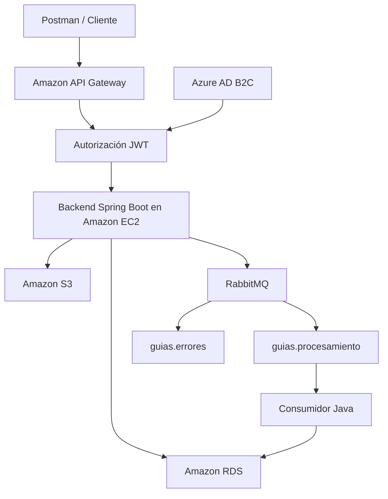

# Sistema de Gestión de Guías de Despacho

Proyecto cloud native desarrollado con Spring Boot para gestionar pedidos y guías de despacho, generar documentos PDF, almacenarlos en Amazon S3 y procesar información de manera asíncrona mediante RabbitMQ.

La solución incorpora autenticación y autorización con Azure AD B2C, protección de endpoints mediante Spring Security y Amazon API Gateway, persistencia en Amazon RDS y despliegue automatizado en Amazon EC2 mediante Docker y GitHub Actions.

## Integrantes

- **Integrante 1:** [Francisco Villarzú Miraglia]
- **Integrante 2:** [Miguel Zananiri Valenzuela]

## Información académica

- **Asignatura:** Desarrollo Cloud Native — CDY2204
- **Actividad:** Desarrollando sistema asíncrono con la utilización de colas
- **Institución:** Duoc UC
- **Semana:** 8

---

## Objetivo del proyecto

Implementar un sistema cloud native que permita:

- Crear guías de despacho.
- Consultar guías por transportista y fecha.
- Modificar y eliminar guías.
- Generar archivos PDF.
- Subir automáticamente los archivos a Amazon S3.
- Descargar los PDF según los permisos del usuario.
- Publicar mensajes en RabbitMQ.
- Consumir y persistir los mensajes procesados.
- Derivar mensajes inválidos hacia una cola de errores.
- Proteger los endpoints mediante JWT y roles.
- Automatizar la integración y el despliegue del sistema.

> Amazon RDS fue utilizado en reemplazo de Oracle Cloud con autorización del docente.

---

## Arquitectura



### Flujo principal

```text
Cliente
→ API Gateway
→ Validación del JWT
→ Spring Security
→ Creación de la guía
→ Generación del PDF
→ Subida automática a S3
→ Publicación en RabbitMQ
→ Consumo del mensaje
→ Persistencia en Amazon RDS
```

---

## Tecnologías utilizadas

| Tecnología | Aplicación en el proyecto |
|---|---|
| Java 17 | Lenguaje principal |
| Spring Boot | Desarrollo del backend |
| Spring MVC | Implementación de endpoints REST |
| Spring Security | Protección mediante JWT y roles |
| Spring Data JPA | Acceso y persistencia de datos |
| Spring AMQP | Integración con RabbitMQ |
| RabbitMQ | Procesamiento asíncrono de mensajes |
| PostgreSQL | Motor de base de datos |
| Amazon RDS | Persistencia en el ambiente desplegado |
| H2 | Persistencia temporal en desarrollo |
| Apache PDFBox | Generación de documentos PDF |
| Amazon S3 | Almacenamiento de archivos |
| Amazon EC2 | Ejecución del backend y RabbitMQ |
| Amazon API Gateway | Exposición y protección de endpoints |
| Azure AD B2C | Autenticación y emisión de tokens |
| Docker | Contenerización de los componentes |
| Docker Hub | Registro de imágenes Docker |
| GitHub Actions | Integración y despliegue continuo |
| Postman | Pruebas de los endpoints |

---

## Funcionalidades principales

### Gestión de guías

El backend permite:

- Crear una guía de despacho.
- Obtener una guía por su identificador.
- Consultar guías por transportista y fecha.
- Consultar el historial de guías.
- Modificar los datos de una guía.
- Eliminar el archivo asociado a una guía.
- Descargar el documento PDF generado.

### Generación y almacenamiento de archivos

Cuando una guía es creada:

1. Se almacena la información de la guía.
2. Se genera un archivo PDF.
3. El PDF se sube automáticamente a Amazon S3.
4. Se registra la clave del objeto almacenado.
5. Se publica un mensaje en RabbitMQ.

Los archivos utilizan una estructura organizada por fecha y transportista:

```text
fecha/
└── transportista/
    └── guia-despacho-id.pdf
```

Ejemplo:

```text
2026-07-12/
└── transportes-cloud/
    └── guia-despacho-7.pdf
```

---

## Procesamiento asíncrono con RabbitMQ

La solución utiliza los siguientes componentes:

| Componente | Nombre | Responsabilidad |
|---|---|---|
| Cola principal | `guias.procesamiento` | Almacenar guías pendientes de procesamiento |
| Cola de errores | `guias.errores` | Conservar mensajes que no pudieron procesarse |
| Exchange principal | `guias.exchange` | Enrutar los mensajes de guías |
| Exchange de errores | `guias.dlx` | Enrutar mensajes fallidos |
| Routing key principal | `guias.creada` | Enviar mensajes a la cola principal |
| Routing key de error | `guias.error` | Enviar mensajes a la cola de errores |

### Flujo correcto

```text
Creación de guía
→ productor Java
→ guias.exchange
→ guias.procesamiento
→ consumidor Java
→ Amazon RDS
```

### Flujo de error

```text
Mensaje inválido
→ error durante el consumo
→ guias.dlx
→ guias.errores
```

Los mensajes consumidos se almacenan en una tabla independiente denominada:

```text
GUIAS_PROCESADAS_COLA
```

---

## Seguridad

El sistema utiliza seguridad en dos niveles.

### Amazon API Gateway

API Gateway:

- Expone los endpoints del backend.
- Valida la presencia y validez del JWT.
- Rechaza solicitudes no autenticadas.
- Redirige las solicitudes autorizadas hacia Amazon EC2.

### Spring Security

Spring Security:

- Valida el JWT recibido.
- Convierte los claims del token en roles.
- Restringe los endpoints de acuerdo con los permisos.
- Mantiene una arquitectura sin sesiones.

### Roles

| Rol | Permisos |
|---|---|
| `GESTOR_GUIAS` | Crear, consultar, modificar, eliminar, gestionar S3 y consumir mensajes |
| `DESCARGA_GUIAS` | Descargar archivos PDF |

Resultados esperados:

| Situación | Resultado |
|---|---:|
| Token válido y rol autorizado | `200 OK` o `201 Created` |
| Token válido sin permisos suficientes | `403 Forbidden` |
| Solicitud sin token o con token inválido | `401 Unauthorized` |

---

## Endpoints REST

La API se encuentra expuesta mediante Amazon API Gateway.

| Método | Endpoint | Rol requerido | Descripción |
|---|---|---|---|
| `POST` | `/api/guias` | `GESTOR_GUIAS` | Crear una guía |
| `GET` | `/api/guias` | `GESTOR_GUIAS` | Consultar por transportista y fecha |
| `GET` | `/api/guias/historial` | `GESTOR_GUIAS` | Consultar el historial |
| `GET` | `/api/guias/{id}` | `GESTOR_GUIAS` | Obtener una guía por ID |
| `PUT` | `/api/guias/{id}` | `GESTOR_GUIAS` | Modificar una guía |
| `POST` | `/api/guias/{id}/s3` | `GESTOR_GUIAS` | Subir o reintentar una subida |
| `PUT` | `/api/guias/{id}/s3` | `GESTOR_GUIAS` | Reemplazar el PDF en S3 |
| `DELETE` | `/api/guias/{id}` | `GESTOR_GUIAS` | Eliminar el archivo asociado |
| `DELETE` | `/api/guias/{id}/s3` | `GESTOR_GUIAS` | Ruta alternativa de eliminación |
| `GET` | `/api/guias/{id}/descargar` | `DESCARGA_GUIAS` | Descargar el PDF |
| `GET` | `/api/guias/{id}/s3` | `DESCARGA_GUIAS` | Ruta alternativa de descarga |
| `POST` | `/api/guias/cola/consumir` | `GESTOR_GUIAS` | Consumir mensajes de RabbitMQ |

### Ejemplo de creación

```json
{
  "numeroPedido": "PED-001",
  "transportista": "Transportes Cloud",
  "destinatario": "Cliente de prueba",
  "direccionDestino": "Avenida Principal 123",
  "ciudadDestino": "Santiago",
  "fechaDespacho": "2026-07-12",
  "descripcionCarga": "Equipamiento tecnológico",
  "pesoKg": 35.5
}
```

### Ejemplo de respuesta del consumidor

```json
{
  "mensajesRecibidos": 1,
  "mensajesGuardados": 1,
  "mensajesEnviadosAErrores": 0,
  "detalle": "Consumo de la cola finalizado."
}
```

---

## Persistencia

### Desarrollo

Durante el desarrollo local se utiliza una base de datos H2 en memoria.

### Ambiente desplegado

En el ambiente cloud se utiliza PostgreSQL mediante Amazon RDS.

La tabla principal almacena las guías generadas, mientras que la tabla `GUIAS_PROCESADAS_COLA` conserva los mensajes consumidos desde RabbitMQ.

Esta separación permite mantener trazabilidad entre:

- la guía original;
- el mensaje enviado;
- el momento de procesamiento;
- el payload recibido.

---

## Contenedores

La solución utiliza dos contenedores principales en Amazon EC2:

```text
gestiondespachos-ec2
gestiondespachos-rabbitmq
```

Ambos se conectan mediante una red Docker privada:

```text
gestiondespachos-network
```

El backend se comunica con RabbitMQ utilizando el nombre del contenedor dentro de la red, evitando exponer públicamente el puerto AMQP.

---

## Integración y despliegue continuo

El workflow de GitHub Actions se ejecuta automáticamente al enviar cambios a la rama `main`.

### Etapas del pipeline

```text
Checkout del repositorio
→ configuración de Java
→ ejecución de pruebas
→ levantamiento temporal de RabbitMQ
→ construcción de la imagen Docker
→ publicación en Docker Hub
→ conexión con Amazon EC2
→ despliegue de RabbitMQ
→ validación de estado saludable
→ despliegue del backend
```

La configuración sensible utilizada durante el despliegue se administra mediante variables de entorno y mecanismos seguros del repositorio, sin almacenarse directamente en el código fuente.

---

## Ejecución local

### Requisitos

- Java 17.
- Docker Desktop.
- Maven o Maven Wrapper.
- Git.

### Levantar RabbitMQ

```bash
docker compose up -d
```

Comprobar su estado:

```bash
docker compose ps
```

### Ejecutar el backend

Windows:

```powershell
.\mvnw.cmd spring-boot:run
```

Linux o macOS:

```bash
./mvnw spring-boot:run
```

### Ejecutar pruebas

```powershell
.\mvnw.cmd clean test
```

RabbitMQ debe encontrarse activo antes de ejecutar las pruebas locales.

La configuración sensible requerida por el backend debe proporcionarse mediante variables de entorno locales y no debe almacenarse en el repositorio.

---

## Estructura principal

```text
gestiondespachos/
├── .github/
│   └── workflows/
│       └── deploy.yml
├── src/
│   ├── main/
│   │   ├── java/com/duoc/gestiondespachos/
│   │   │   ├── config/
│   │   │   ├── controller/
│   │   │   ├── dto/
│   │   │   ├── entity/
│   │   │   ├── exception/
│   │   │   ├── repository/
│   │   │   └── service/
│   │   └── resources/
│   │       ├── application.properties
│   │       ├── application-dev.properties
│   │       └── application-rds.properties
│   └── test/
├── Dockerfile
├── docker-compose.yml
├── pom.xml
└── README.md
```

---

## Pruebas realizadas

El sistema fue validado mediante las siguientes pruebas:

- Creación de guías.
- Generación de archivos PDF.
- Subida automática a Amazon S3.
- Publicación de mensajes en RabbitMQ.
- Consumo de mensajes correctos.
- Persistencia de mensajes en Amazon RDS.
- Derivación de mensajes inválidos a la cola de errores.
- Consulta por transportista y fecha.
- Modificación de guías.
- Reemplazo de documentos en Amazon S3.
- Descarga mediante un rol autorizado.
- Bloqueo de operaciones no permitidas.
- Rechazo de solicitudes sin autenticación.
- Eliminación de archivos.
- Ejecución de endpoints mediante API Gateway.
- Despliegue automatizado mediante GitHub Actions.

---

## Consideraciones de seguridad

No deben incorporarse al repositorio:

- credenciales;
- tokens JWT;
- archivos de configuración local sensibles;
- claves privadas;
- contraseñas de bases de datos;
- valores internos de los servicios cloud.

Toda la configuración sensible debe suministrarse externamente mediante variables de entorno o mecanismos seguros de CI/CD.

---

## Estado del proyecto

El sistema implementa satisfactoriamente:

- Backend Spring Boot.
- Productor y consumidor Java.
- Procesamiento asíncrono con RabbitMQ.
- Cola para mensajes con errores.
- Persistencia en Amazon RDS.
- Generación y almacenamiento de PDF en Amazon S3.
- Autenticación mediante Azure AD B2C.
- Autorización mediante Spring Security.
- Integración con Amazon API Gateway.
- Contenerización mediante Docker.
- Despliegue automatizado en Amazon EC2.

---

## Uso académico

Proyecto desarrollado con fines académicos para la asignatura Desarrollo Cloud Native.